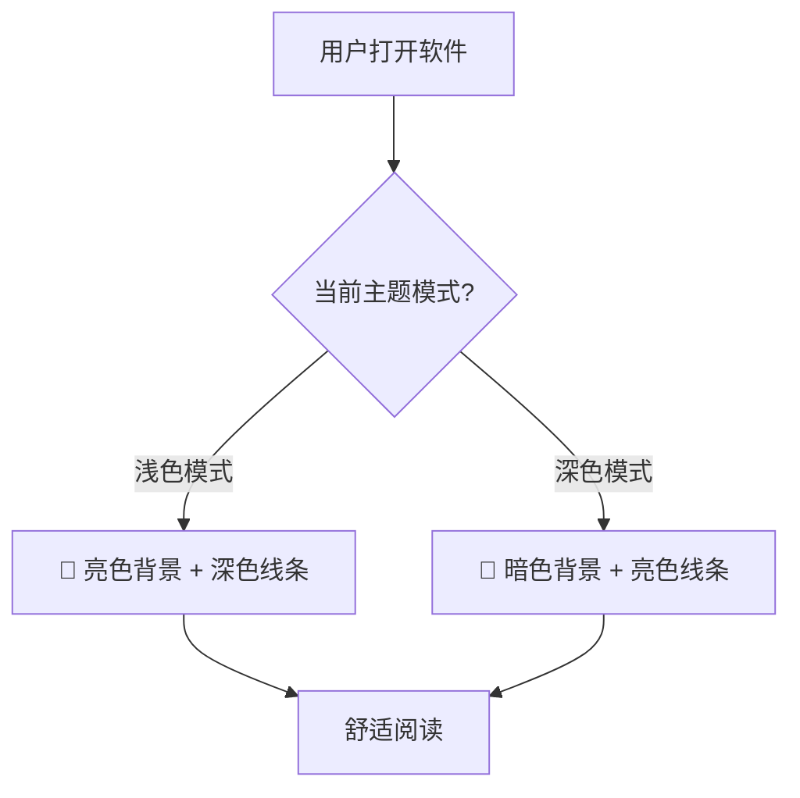
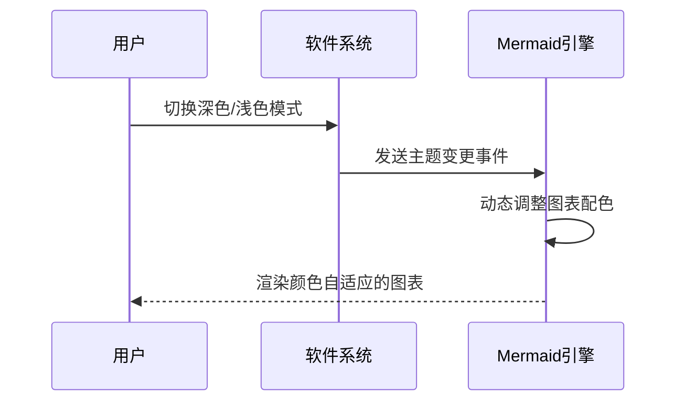
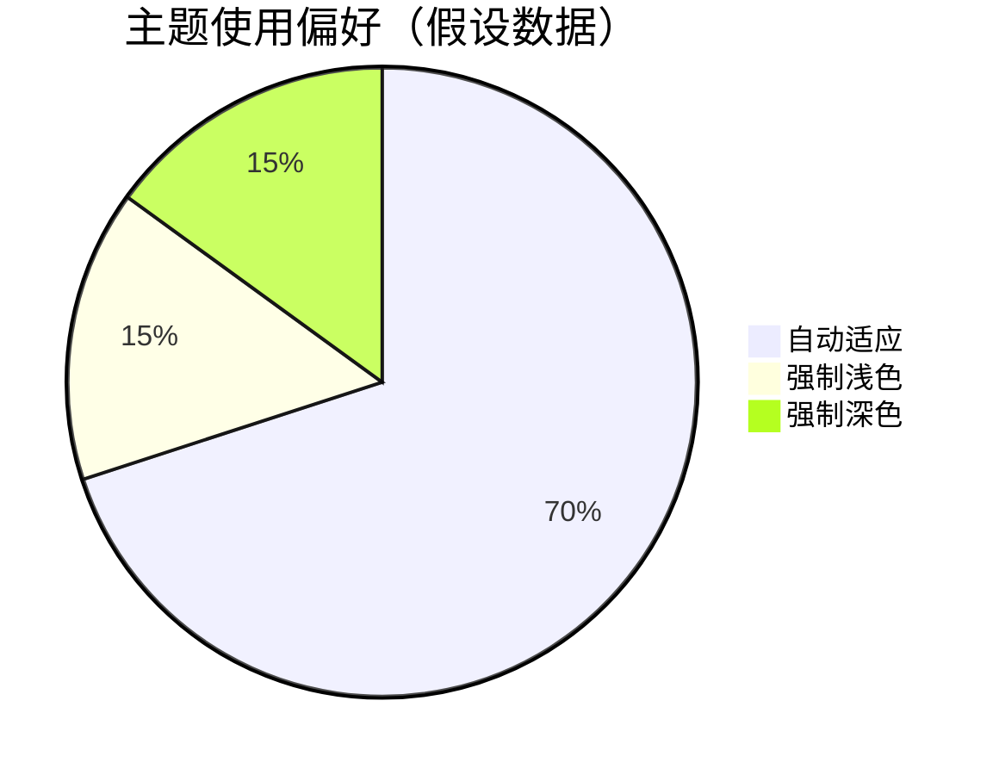

# ✨ KaTeX 与 Mermaid 增强特性演示

本文档展示了最新版本中 **KaTeX（数学公式）** 和 **Mermaid（图表）** 的两项重要改进。

---

## 1. KaTeX（数学公式）增强

### 🎯 稳健渲染
现在可以准确识别 `$行内公式$` 和 `$$块级公式$$`，并支持 `\$` 转义普通美元符号。

**行内公式示例**：  
勾股定理 $a^2 + b^2 = c^2$，质能方程 $E = mc^2$。

**块级公式示例**：
$$ \int_{-\infty}^{\infty} e^{-x^2} \, dx = \sqrt{\pi} $$

**块级公式示例**：
$$ \int_{-\infty}^{\infty} e^{-x^2} \, dx = \sqrt{\pi} $$

**块级公式示例**：
$$ \int_{-\infty}^{\infty} e^{-x^2} \, dx = \sqrt{\pi} $$

**转义美元符号**：  
商品价格是 \$99.99（不会被识别为公式），而数学公式 $x = 5\$ 表示 5 美元？更清晰的写法：普通文本中的美元符号只需写 `\$` 即可。

### 📜 滚动支持（长公式水平滚动）
在窄窗口或移动端下，超长公式会自动出现水平滚动条，不会撑破页面布局：

$$ \begin{pmatrix} 
a_{11} & a_{12} & \cdots & a_{1n} & a_{1(n+1)} & \cdots & a_{1(2n)} \\
a_{21} & a_{22} & \cdots & a_{2n} & a_{2(n+1)} & \cdots & a_{2(2n)} \\
\vdots & \vdots & \ddots & \vdots & \vdots & \ddots & \vdots \\
a_{m1} & a_{m2} & \cdots & a_{mn} & a_{m(n+1)} & \cdots & a_{m(2n)}
\end{pmatrix} \times 
\begin{pmatrix} 
b_{1} \\ b_{2} \\ \vdots \\ b_{2n}
\end{pmatrix} = 
\text{结果矩阵继续延伸以测试水平滚动……} \cdots \cdots \cdots \cdots \cdots \cdots \cdots $$

### ⚠️ 错误可视化
当 LaTeX 语法写错时，KaTeX 会以 **红色虚线** 标出错误位置（具体渲染依赖于集成环境）。  
例如下面的错误公式：

- 行内错误：$\frac{1}{$（缺少右花括号）  
- 块级错误：  
  $$ \sqrt{x^2 + $ 错误语法 }  

> 💡 提示：正确的公式应该是 $\frac{1}{2}$ 和 $\sqrt{x^2 + y^2}$。

---

## 2. Mermaid（图表）优化

### 🌗 主题自适应（最重要的改进）
图表会**自动跟随软件主题**切换颜色。在深色模式下，图表自动变为暗色背景 + 亮色线条，不再出现白色背景“闪瞎眼”的情况。

**示例 1：流程图**（主题自适应展示）

**示例 2：时序图**（展示主题色跟随）

**示例 3：饼图**（直观感受主题影响）

### ⚡ 性能优化
- 通过 `mermaid.render` 进行**异步渲染**，避免阻塞页面主线程。
- 为每个图表分配**唯一标识符**，支持动态加载和多图表共存，提升复杂文档的渲染效率。

---

## 总结
本次更新显著提升了数学公式和图表的使用体验：
- **KaTeX**：更智能的公式识别、长公式滚动、清晰错误提示。
- **Mermaid**：完美跟随系统主题，大幅优化深色模式下的可读性，渲染性能更流畅。

试试把你的软件切换到深色模式，再看上面的图表和公式吧！ 🚀
